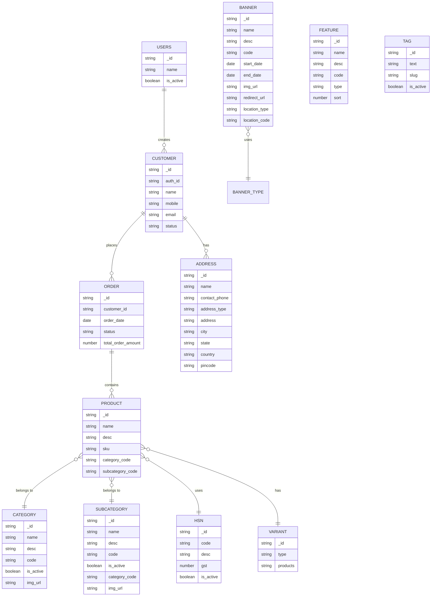
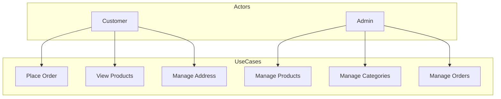
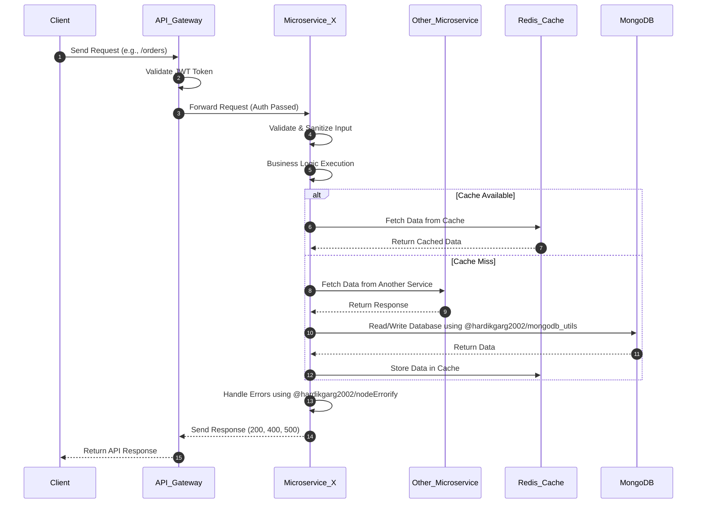
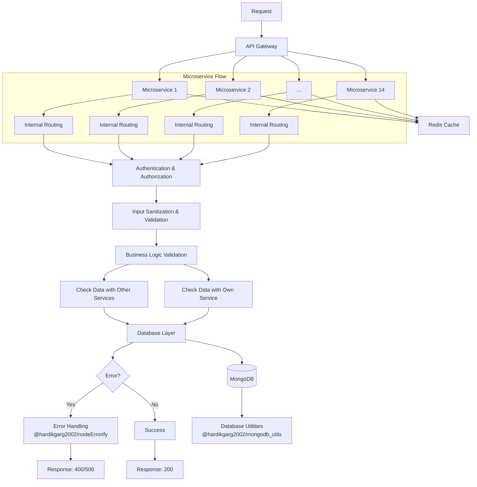

# E-Commerce Application

## Table of Contents
1. [Overview](#overview)
2. [Features](#features)
3. [Services](#services)
4. [Query Parameters and Pagination](#query-parameters-and-pagination)
5. [Tech Stack](#tech-stack)
6. [Setup Instructions](#setup-instructions)
7. [Environment Variables](#environment-variables)
8. [API Documentation](#api-documentation)
9. [Testing](#testing)
10. [Deployment](#deployment)
11. [Contributing](#contributing)
12. [License](#license)

---

## Overview
This is a production-level e-commerce application designed to manage products, categories, variants, banners, orders, and more. It provides a robust API for frontend applications and supports features like user authentication, product search, and order management.

---
## Architecture Diagram


[View Interactive Diagram] 

---

## Features
- **Product Management**: Add, update, delete, and search products.
- **Category Management**: Organize products into categories and subcategories.
- **Variant Management**: Handle product variants (e.g., size, color).
- **Banner Management**: Manage promotional banners for the storefront.
- **Order Management**: Handle customer orders and admin order management.
- **Customer Management**: Manage customer profiles and data.
- **HSN Code Management**: Manage HSN (Harmonized System of Nomenclature) codes for products.
- **Tag Management**: Add and manage product tags for better searchability.

---

## Services
The application is divided into the following services:

### 1. **Category**
   - Manage product categories and subcategories.

### 2. **Feature**
   - Define additional product attributes and valid values.

### 3. **Banner**
   - Manage promotional banners for the storefront.

### 4. **Tag**
   - Handle product tags for better searchability.

### 5. **Hsn**
   - Manage HSN (Harmonized System of Nomenclature) codes for products.

### 6. **Product**
   - Manage products and their details, including variants and aliases.

### 7. **Consumer**
   - Retrieve consumer data.

### 8. **Order**
   - Handle customer orders and admin order management.

### 9. **Customer**
   - Manage customer profiles and data.

For detailed API documentation, visit the [Swagger Documentation](#api-documentation).

---

## Query Parameters and Pagination
All `GET` endpoints support the following query parameters for filtering, sorting, and pagination:

### Query Parameters
- **filters**: A JSON object to filter results based on specific fields.
  - Example: `filters={"category": "electronics", "price": {"$lt": 1000}}`
- **sort**: Sort results by a specific field.
  - Example: `sort=price` (ascending) or `sort=-price` (descending).
- **pagination[page]**: The page number to retrieve.
  - Example: `pagination[page]=1`
- **pagination[pageSize]**: The number of items per page.
  - Example: `pagination[pageSize]=10`

### Paginated Response
All `GET` endpoints return paginated responses in the following format:
```json
{
  "data": [...], // Array of results
  "pagination": {
    "page": 1, // Current page number
    "pageSize": 10, // Number of items per page
    "totalItems": 100, // Total number of items
    "totalPages": 10 // Total number of pages
  }
}
```







